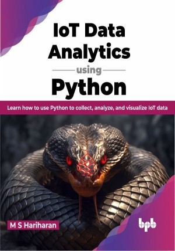

# IoT Data Analytics using Python

Harness the power of Python to analyze your IoT data

This is the repository for [IoT Data Analytics using Python
](https://bpbonline.com/products/iot-data-analytics-using-python),published by BPB Publications.

## About the Book
Python is a popular programming language for data analytics, and it is also well-suited for IoT Data Analytics. By leveraging Python's versatility and its rich ecosystem of libraries and tools, Data Analytics for IoT can unlock valuable insights, enable predictive capabilities, and optimize decision-making in various IoT applications and domains.

The book begins with a foundation in IoT fundamentals, its role in digital transformation, and why Python is the preferred language for IoT Data Analytics. It then covers essential data analytics concepts, how to establish an IoT Data Analytics environment, and how to design and manage real-time IoT data flows. Next, the book discusses how to implement Descriptive Analytics with Pandas, Time Series Forecasting with Python libraries, and Monitoring, Preventive Maintenance, Optimization, Text Mining, and Automation strategies. It also introduces Edge Computing and Analytics, discusses Continuous and Adaptive Learning concepts, and explores data flow and use cases for Edge Analytics. Finally, the book concludes with a chapter on IoT Data Analytics for self-driving cars, using the CRISP-DM framework for data collection, modeling, and deployment.

By the end of the book, you will be equipped with the skills and knowledge needed to extract valuable insights from IoT data and build real-world applications.

## What You Will Learn
•  Explore the essentials of IoT Data Analytics and the Industry 4.0 revolution.

•  Learn how to set up the IoT Data Analytics environment.

•  Equip Python developers with data analysis foundations.

•  Learn to build data lakes for real-time IoT data streaming.

•  Learn to deploy machine learning models on edge devices.

•  Understand Edge Computing with MicroPython for efficient IoT Data Analytics.
